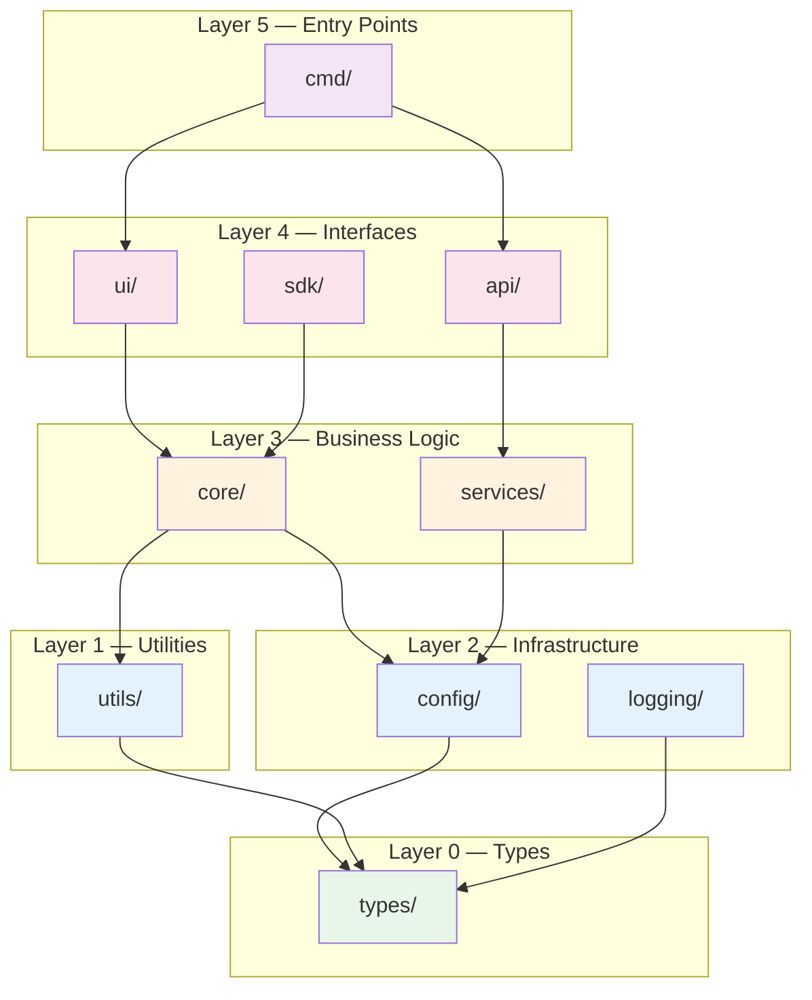
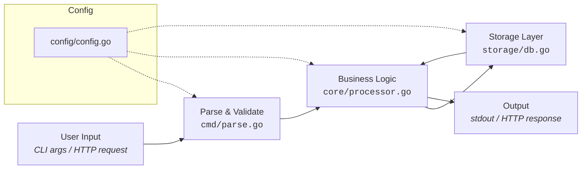
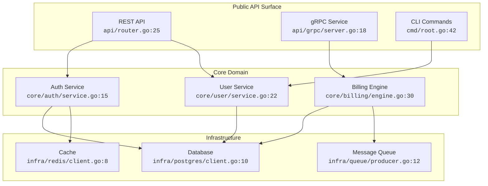
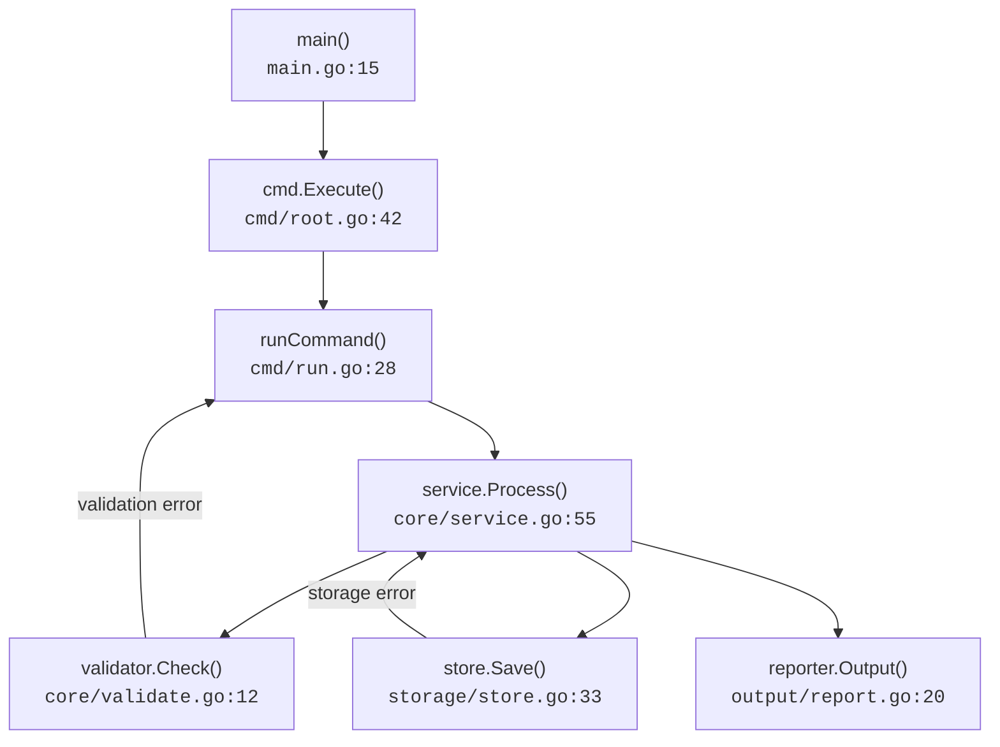
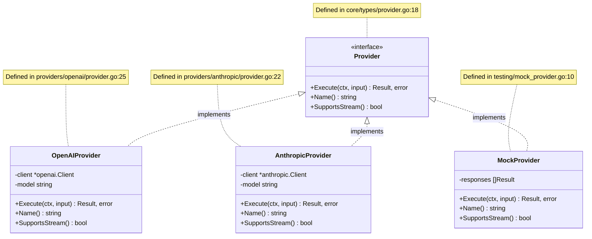
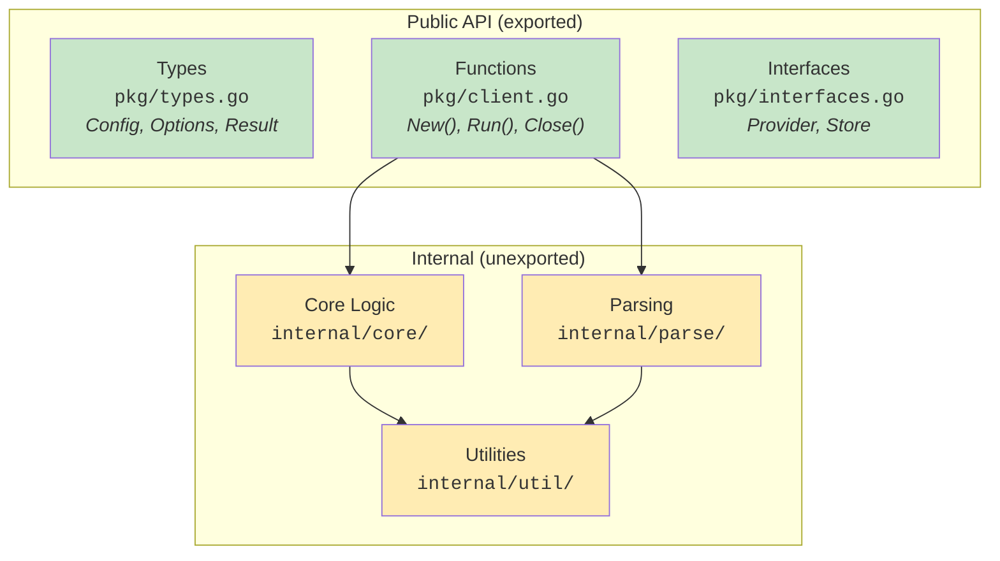
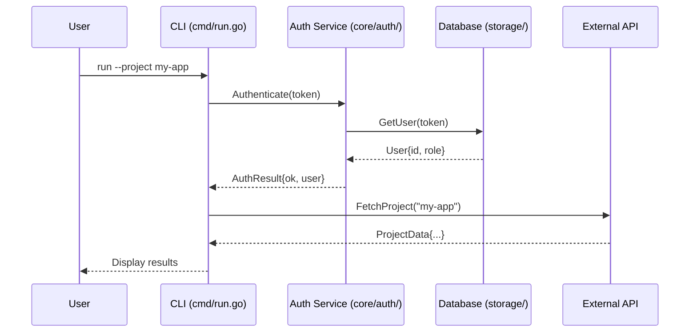

# Architecture Diagram Templates

Auto-generated Mermaid diagrams for visualizing codebase structure. These diagrams are derived
from actual code analysis — not hand-drawn, not aspirational. Every diagram should reflect
what the code **actually does**, not what the author wishes it did.

## Table of Contents

- [How to Generate Diagrams](#how-to-generate-diagrams)
- [Package Dependency Graph](#1-package-dependency-graph)
- [Data Flow Diagram](#2-data-flow-diagram)
- [Component Relationship Diagram](#3-component-relationship-diagram)
- [Call Hierarchy Diagram](#4-call-hierarchy-diagram)
- [Interface Implementation Map](#5-interface-implementation-map)
- [Module Boundary Diagram](#6-module-boundary-diagram)
- [Sequence Diagram for Key Flows](#7-sequence-diagram-for-key-flows)

---

## How to Generate Diagrams

Diagrams are generated by analyzing actual code, not by guessing. Follow this process:

### For Go projects
```bash
# List all packages and their imports
go list -json ./... | jq '{ImportPath, Imports}'

# Find interfaces and their implementations
grep -rn 'type.*interface' --include='*.go' .
grep -rn 'func.*) .*(' --include='*.go' . | head -50

# Map package dependencies
go list -m -json all
```

### For TypeScript/Node projects
```bash
# Find all imports
grep -rn "from ['\"]" --include='*.ts' src/

# Find interfaces and classes
grep -rn "export interface\|export class\|export type" --include='*.ts' src/

# Check package.json dependencies
cat package.json | jq '.dependencies, .devDependencies'
```

### For Python projects
```bash
# Find all imports
grep -rn "^from \|^import " --include='*.py' src/

# Find classes and their bases
grep -rn "class .*:" --include='*.py' src/

# Check dependency declarations
cat pyproject.toml  # or requirements.txt
```

After gathering this data, generate the appropriate Mermaid diagrams below.

---

## 1. Package Dependency Graph

Shows which packages depend on which. The most important diagram for understanding architecture.

### Template

````markdown

````

### Generation Guidance

When generating this diagram from real code:

1. Run `go list -json ./...` (or equivalent for your language)
2. For each package, extract its internal imports
3. Group packages by their layer assignment (from lint-deps rules)
4. Draw edges for each internal import relationship
5. Color by layer level (green=L0, blue=L1-2, orange=L3, pink=L4, purple=L5)

Important: only include **internal** dependencies, not stdlib or third-party.

---

## 2. Data Flow Diagram

Shows how data moves through the system end-to-end.

### Template

````markdown

````

### Generation Guidance

To map data flow accurately:

1. Find entry points (`main()`, HTTP handlers, CLI command handlers)
2. Trace what happens to user input step by step
3. Note which files/functions are involved at each step — include the actual file path
4. Identify where data is transformed, stored, or returned
5. Show config/logging as dotted lines (support infrastructure, not primary flow)

---

## 3. Component Relationship Diagram

Shows the major components and their interactions. Best for projects with clear module boundaries.

### Template

````markdown

````

### Generation Guidance

1. Identify major service/component boundaries
2. For each component, find the primary file and line where it's defined
3. Map method calls between components (grep for cross-package function calls)
4. Group by architectural layer

---

## 4. Call Hierarchy Diagram

Shows the function call chain for critical code paths.

### Template

````markdown

````

### Generation Guidance

1. Start from the entry point of the flow you want to document
2. Use LSP `outgoingCalls` to trace the call chain, or grep for function invocations
3. Include the file and line number for each function
4. Show error paths as labeled edges
5. Keep it to 8-12 nodes max — if more complex, split into sub-diagrams

---

## 5. Interface Implementation Map

Shows which types implement which interfaces. Critical for understanding extensibility.

### Template

````markdown

````

### Generation Guidance

1. Find all interfaces: `grep -rn 'type.*interface' --include='*.go'`
2. Find implementations by matching method signatures
3. For each implementation, list its struct fields (private) and methods (public)
4. Add source file location as notes
5. Focus on the most important interfaces — don't try to diagram everything

---

## 6. Module Boundary Diagram

Shows public vs internal API surface. Useful for library/SDK projects.

### Template

````markdown

````

---

## 7. Sequence Diagram for Key Flows

Shows time-ordered interactions between components for specific user scenarios.

### Template

````markdown

````

### Generation Guidance

1. Pick the 3-5 most common/important user flows
2. Trace the complete sequence from user input to final output
3. Include actual component names and file paths
4. Show both success and error paths
5. Keep each sequence to 10-15 messages max

---

## Diagram Selection Guide

Not every project needs all seven diagram types. Choose based on what matters:

| Project Type | Recommended Diagrams |
|---|---|
| CLI tool | Package Dependency, Data Flow, Call Hierarchy |
| Web API | Package Dependency, Component Relationship, Sequence |
| Library/SDK | Package Dependency, Interface Implementation, Module Boundary |
| Microservice | Component Relationship, Data Flow, Sequence |
| Monolith | Package Dependency, Component Relationship, Interface Implementation |

## Diagram Quality Checklist

Every generated diagram should pass these checks:

- [ ] **Grounded in code**: Every node references an actual file/package (not aspirational)
- [ ] **File references**: Include `code>file:line</code>` where possible
- [ ] **No orphan nodes**: Every node has at least one connection
- [ ] **Layered layout**: Higher-level components at top, lower at bottom
- [ ] **Color coding**: Consistent colors across diagrams in the same project
- [ ] **Reasonable size**: 5-15 nodes per diagram; split if larger
- [ ] **Updated date**: Note when the diagram was last regenerated
