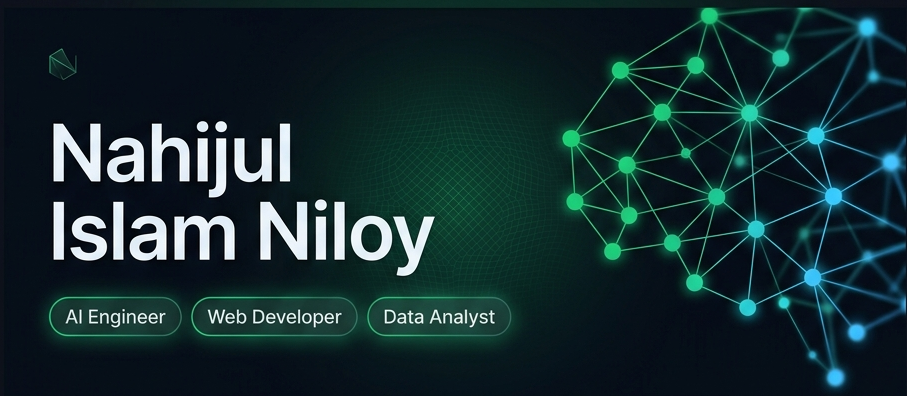

<div align="center">
  
</div>

<br/>

<!-- Typing SVG Hero -->
<div align="center">
  <a href="https://git.io/typing-svg">
    
  </a>
</div>

<br/>

<!-- Profile Views + Socials Row -->
<div align="center">
  
  &nbsp;
  <a href="https://linkedin.com/in/nahijul-islam-niloy-139a09190">
    
  </a>
  &nbsp;
  <a href="mailto:N_iloy@outlook.com">
    
  </a>
  &nbsp;
  <a href="https://nniloy888.netlify.app">
    
  </a>
</div>

---

## About Me

```python
class NahijulIslamNiloy:

    # ─── Identity ────────────────────────────────────────────────────────────
    name        = "Nahijul Islam Niloy"
    location    = "Dhaka, Bangladesh 🇧🇩"
    pronouns    = "He / Him"
    roles       = ["AI Engineer", "Web Developer", "Data Analyst"]
    open_to     = ["Collaborations", "Freelance", "Full-time Opportunities"]

    # ─── Tech Arsenal ────────────────────────────────────────────────────────
    languages   = ["Python", "JavaScript", "SQL", "C", "C++", "Java"]
    ai_stack    = ["LangChain", "HuggingFace", "OpenAI API", "scikit-learn",
                   "TensorFlow", "PyTorch", "FastAPI"]
    web_stack   = ["React", "Vue.js", "Node.js", "HTML5", "CSS3", "Sass"]
    data_stack  = ["pandas", "NumPy", "Matplotlib", "Power BI", "SQL", "Jupyter"]
    devops      = ["Docker", "Azure", "GCP", "Git", "Linux", "Figma"]

    # ─── Current Focus ───────────────────────────────────────────────────────
    building    = "LLM-powered apps with RAG pipelines & AI agents"
    crafting    = "Full-stack web experiences with modern JS frameworks"
    analyzing   = "Data-driven insights through interactive dashboards"
    learning    = "Multi-agent systems · Vector DBs · Cloud-native AI"

    # ─── Fun Facts ───────────────────────────────────────────────────────────
    hobbies     = ["Anime", "Problem Solving", "Open Source"]
    anime       = ["Fullmetal Alchemist", "Attack on Titan",
                   "Hunter x Hunter", "Mob Psycho 100"]
    motto       = "Turn data into decisions. Turn ideas into products."
```

<div align="center">

| 🤖 AI & ML | 🌐 Web Dev | 📊 Data | ☁️ DevOps |
|:-----------:|:----------:|:-------:|:---------:|
| LLMs · RAG · Agents | React · Vue · Node | pandas · Power BI | Docker · Azure · GCP |

</div>

---

## Tech Stack

### AI / Machine Learning
<p>
  
  &nbsp;
  
  
  
  
  
</p>

### Web Development
<p>
  
</p>

### Data & Analytics
<p>
  
  
  
  
  
  
  &nbsp;
  
</p>

### DevOps & Tools
<p>
  
</p>

---

## GitHub Analytics

<div align="center">

<!-- Row 1: Profile Details + Top Languages -->
<table>
  <tr>
    <td width="55%" align="center">
      
    </td>
    <td width="45%" align="center">
      
    </td>
  </tr>
</table>

<!-- Row 2: Streak + GitHub Stats (side by side) -->
<table>
  <tr>
    <td width="50%" align="center">
      
    </td>
    <td width="50%" align="center">
      
    </td>
  </tr>
</table>

</div>

---

## Currently Building

<table>
<tr>
<td width="50%">

**What I'm working on**
- LLM-powered applications with RAG pipelines
- AI agents for workflow automation
- Data visualization dashboards
- Full-stack web apps with modern frameworks

</td>
<td width="50%">

**What I'm exploring**
- Multi-agent AI systems
- Vector databases & embeddings
- Real-time data streaming
- Cloud-native AI deployment

</td>
</tr>
</table>

---

## Contribution Activity

<!-- Activity Graph: shows Month · Day · Year on X-axis -->
<div align="center">
  
</div>

<!-- Snake animation: per-day cell heatmap -->
<div align="center">
  <picture>
    <source media="(prefers-color-scheme: dark)" srcset="https://raw.githubusercontent.com/c-onfused69/c-onfused69/output/github-contribution-grid-snake-dark.svg"/>
    <source media="(prefers-color-scheme: light)" srcset="https://raw.githubusercontent.com/c-onfused69/c-onfused69/output/github-contribution-grid-snake.svg"/>
    
  </picture>
</div>

---

## Connect

<div align="center">

| Platform | Link |
|----------|------|
| **Portfolio** | [nniloy888.netlify.app](https://nniloy888.netlify.app) |
| **LinkedIn** | [Nahijul Islam Niloy](https://linkedin.com/in/nahijul-islam-niloy-139a09190) |
| **Email** | [N_iloy@outlook.com](mailto:N_iloy@outlook.com) |
| **Facebook** | [confused.as69](https://fb.com/confused.as69) |

</div>

<br/>

<div align="center">
  <i>⚡ Fun fact: My favorite anime are Fullmetal Alchemist, Attack on Titan, Hunter x Hunter, and Mob Psycho 100.</i>
</div>

<br/>

<div align="center">
  
</div>
